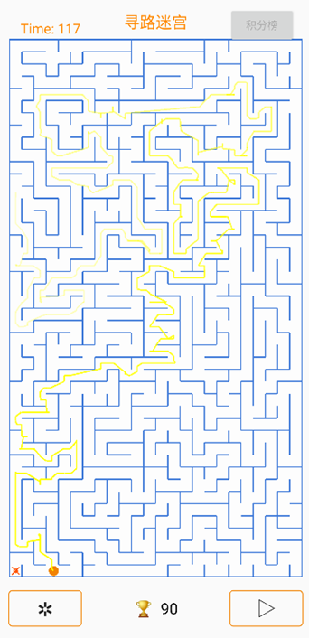
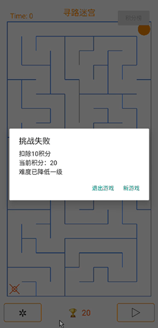
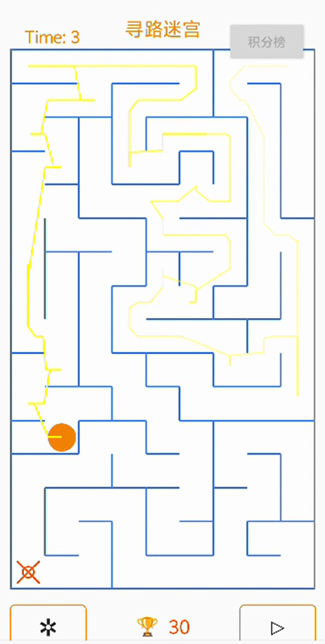
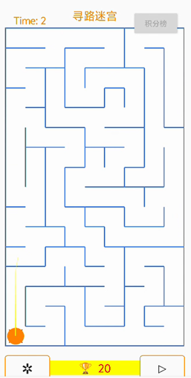

# 迷宫冲刺 - Android迷宫冒险游戏

## 项目概述

《迷宫冲刺》是一款基于Android平台的休闲益智游戏，玩家需要在限定时间内控制小球从起点移动到终点。游戏具有动态难度调整、积分系统和排行榜等特色功能。



## 主要功能

### 1. 动态难度系统

- **成功通关**：自动增加迷宫难度并加分

  - 初始迷宫：15秒时限
  - 最高难度：120秒时限（指数级增长）
  - 积分奖励：前4次成功+10分，后续+20分等等，最难迷宫+100分

- **失败惩罚**：自动降低迷宫难度并扣分

  

- 迷宫复杂度设置：

  ```
  public static final float MIN_CELL_SIZE_INCH = 0.15f; // 最小单元格尺寸
  public static final int MIN_SHORT_EDGE_CELLS_COUNT = 8; // 屏幕短边最小单元格数
  ```

### 2. 注册登录与排行榜

- **用户系统**：

  - 注册新账号
  - 登录已有账号
  - 测试账号：用户名 `111`，密码 `123`

  

- **排行榜功能**：

  - 记录前20名玩家最高分
  - 显示当前玩家排名
  - 使用SharedPreferences存储数据


### 3. 创新功能：积分兑换穿墙时间

- 点击底部奖杯图标
- 消耗20积分换取0.3秒穿墙能力
- 在紧急情况下穿越迷宫墙壁

​       								    									

## 开发分工

| 成员   | 贡献内容                             |
| :----- | :----------------------------------- |
| 刘海娟 | 动态难度系统、积分兑换功能、报告框架 |
| 司若男 | 注册登录系统、排行榜界面、报告润色   |

## 运行说明

1. **环境要求**：
   - Android Studio
   - 兼容Android 5.0+设备
2. **游戏操作**：
   - 拖动控制小球移动
   - 注意右上角倒计时
   - 点击底部奖杯图标使用穿墙能力

## 功能验证

- 演示视频

- <video src="./../../../../Videos/计算机网络实验/屏幕录制 2025-06-10 181439.mp4"></video>
https://github.com/user-attachments/assets/82bb432a-c4b1-4107-ab8d-4db9b6ede931


## 未来计划

1. 引入正计时奖励机制：通关时间越短，积分奖励越多
2. 增加游戏元素：随机礼物/障碍物
3. 优化穿墙特效和动画
4. 扩展小球属性和技能系统

## 致谢

特别感谢凌妙根老师在游戏设计上提供的宝贵建议和指导。

------

**项目源码**：[https://github.com/abaokkk/Minos1]
**开发文档**：[见文件夹]


> 提示：游戏难度会随您的表现动态调整，合理使用穿墙能力是通关高难度迷宫的关键！
